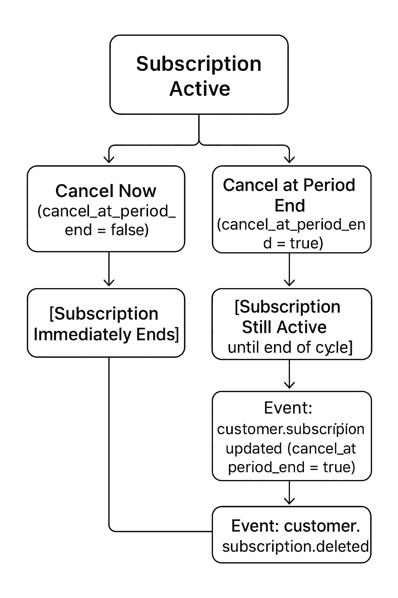

> 24 - September - 2025

# Stripe Product

Build a stripe payment system for product

⚙️ This project was created by `bun`

```sh
bun install
```

```sh
bun dev
```

🛢️ For db run locally (sync)

```sh
bunx convex dev
```

## 📦 Packages:-

- bunx create-next-app@14.2.15 .
- bunx --bun shadcn@latest init
- bun add convex
- bunx --bun shadcn@latest add button
- bunx --bun shadcn@latest add card
- bunx --bun shadcn@latest add badge
- bunx --bun shadcn@latest add skeleton
- bunx --bun shadcn@latest add sonner
- bun add stripe

### 🪝 Stripe Webhook (local testing)

- run at cmd & this will generate a - `signing secret` for using this web-hook locally.
  
```js
stripe listen --forward-to localhost:3000/api/webhooks/stripe
```

### 🛠️ Set .env values

```js
NEXT_PUBLIC_APP_URL = *******
NEXT_PUBLIC_CONVEX_URL = *******
NEXT_PUBLIC_CLERK_PUBLISHABLE_KEY = *******

CLERK_SECRET_KEY = *******
CLERK_JWT_ISSUER_DOMAIN = *******

STRIPE_SECRET_KEY = *******
STRIPE_WEBHOOK_SECRET = *******

STRIPE_MONTHLY_PRICE_ID = *******
STRIPE_YEARLY_PRICE_ID = *******

UPSTASH_REDIS_REST_URL = *******
UPSTASH_REDIS_REST_TOKEN = *******
```

### 📎 Reference

- 🎨 [`Shadcn Components`](https://ui.shadcn.com/docs/components)
- 🛢️ [`Convex Dashboard`](https://dashboard.convex.dev)
- 📄 [`Convex Doc`](https://docs.convex.dev)
- 🛡️ [`Clerk Dashboard`](https://dashboard.clerk.com)
- 📄 [`Clerk Doc`](https://clerk.com/docs)
- 💰 [`Stripe Dashboard`](https://dashboard.stripe.com)
- 🎯 [`Upstash Dashboard`](https://console.upstash.com)

### 📝 Learning Context:-

- manually data input at convex db
  - bunx convex import --table <TABLE_NAME> <FILE_NAME.json>
- `One time` product purchase system
- `Recurring based subscription` product purchase system
- By `webhook` event listener request - update database record

### 🪝 Stripe checkout webhook events:-

- When using Stripe Checkout, a single purchase triggers multiple webhook events (like table).
- As part of Stripe’s normal payment lifecycle, we typically only need to handle `checkout.session.completed` for fulfillment.

| Event Type                  | What It Means                                                                     |
|-----------------------------|-----------------------------------------------------------------------------------|
|payment_intent.created       | A PaymentIntent was created (represents the intent to collect payment).           |
|charge.succeeded             | The actual charge (money transfer) succeeded.                                     |
|payment_intent.succeeded     | The full PaymentIntent succeeded (includes charge + any other steps).             |
|`checkout.session.completed` | The customer successfully completed the Checkout session (this is the most important one for most apps).|
|charge.updated               | A minor update to the charge object (e.g., metadata, fraud details, etc.).        |

### Single Product Buy Webhook Log:-

[WEB_HOOK][hookLink]

[hookLink]: http://localhost:3000/api/webhooks/stripe

```js
2025-10-06 05:22:28   --> charge.succeeded [evt_Wug]
2025-10-06 05:22:29   --> payment_intent.succeeded [evt_GjB]
2025-10-06 05:22:29   --> payment_intent.created [evt_p5W]
2025-10-06 05:22:29   --> checkout.session.completed [evt_m2Y]
2025-10-06 05:22:29  <--  [200] POST [WEB_HOOK] [evt_GjB]
2025-10-06 05:22:29  <--  [200] POST [WEB_HOOK] [evt_Wug]
2025-10-06 05:22:29  <--  [200] POST [WEB_HOOK] [evt_p5W]
2025-10-06 05:22:31  <--  [200] POST [WEB_HOOK] [evt_m2Y]
2025-10-06 05:22:31   --> charge.updated [evt_UnD]
2025-10-06 05:22:31  <--  [200] POST [WEB_HOOK] [evt_UnD]
```

### Subscription Purchase Webhook Log:-

```js
2025-10-08 19:37:20   --> charge.succeeded [evt_dlv]
2025-10-08 19:37:20   --> payment_method.attached [evt_Sn7]
2025-10-08 19:37:20   --> checkout.session.completed [evt_Xre]
2025-10-08 19:37:20   --> customer.updated [evt_MnF]
2025-10-08 19:37:21   --> customer.subscription.created [evt_naa]
2025-10-08 19:37:21   --> payment_intent.succeeded [evt_hpN]
2025-10-08 19:37:21   --> payment_intent.created [evt_ayu]
2025-10-08 19:37:21   --> invoice.created [evt_Kw5]
2025-10-08 19:37:21   --> invoice.finalized [evt_27R]
2025-10-08 19:37:21   --> invoice.paid [evt_18t]
2025-10-08 19:37:21   --> invoice.payment_succeeded [evt_urV]
2025-10-08 19:37:21  <--  [200] POST [WEB_HOOK] [evt_Sn7]
2025-10-08 19:37:21  <--  [200] POST [WEB_HOOK] [evt_Kw5]
2025-10-08 19:37:21  <--  [200] POST [WEB_HOOK] [evt_hpN]
2025-10-08 19:37:21  <--  [200] POST [WEB_HOOK] [evt_ayu]
2025-10-08 19:37:21  <--  [200] POST [WEB_HOOK] [evt_dlv]
2025-10-08 19:37:21  <--  [200] POST [WEB_HOOK] [evt_Xre]
2025-10-08 19:37:21  <--  [200] POST [WEB_HOOK] [evt_MnF]
2025-10-08 19:37:22  <--  [200] POST [WEB_HOOK] [evt_27R]
2025-10-08 19:37:22  <--  [200] POST [WEB_HOOK] [evt_18t]
2025-10-08 19:37:22  <--  [200] POST [WEB_HOOK] [evt_urV]
2025-10-08 19:37:22   --> invoice_payment.paid [evt_95C]
2025-10-08 19:37:22  <--  [200] POST [WEB_HOOK] [evt_95C]
2025-10-08 19:37:24  <--  [200] POST [WEB_HOOK] [evt_naa]

```

### Subscription Billing Manage (Deleted) Webhook Log:-

```js
2025-10-10 18:00:57   --> billing_portal.session.created [evt_SWy]
2025-10-10 18:00:57  <--  [200] POST [WEB_HOOK] [evt_SWy]

2025-10-10 18:01:38   --> customer.subscription.updated [evt_8ny]
2025-10-10 18:01:41  <--  [200] POST [WEB_HOOK] [evt_8ny]

2025-10-10 18:42:56   --> customer.subscription.deleted [evt_b6v] ⬅️⬅️⬅️ auto run || manually click form dashboard
2025-10-10 18:42:57  <--  [200] POST [WEB_HOOK] [evt_b6v]
```


